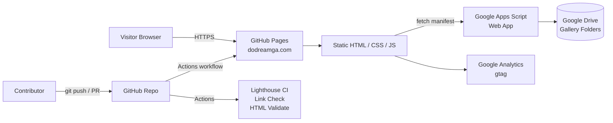

# DoDream Baptist Church — dodreamga.com

[](https://github.com/jwoo6310/dodreamga.com/actions/workflows/deploy.yml)
[](https://github.com/jwoo6310/dodreamga.com/actions/workflows/quality.yml)
[](./LICENSE)
[](https://tailwindcss.com/)

The official website of **DoDream Baptist Church**, a bilingual (한국어 / English) Korean-American church community in Georgia. Built and maintained as a static, zero-backend site deployed through GitHub Pages.

**Live site:** [https://dodreamga.com](https://dodreamga.com)

## Overview

This site is multi-page static HTML styled with Tailwind CSS. It supports runtime Korean/English language switching, a photo gallery backed by Google Drive through a Google Apps Script web app, and an interactive world map highlighting supported missionaries. All hosting and content updates happen through GitHub — no server, no database, no build step required for day-to-day updates.

## Architecture



The gallery is intentionally decoupled from the repo: adding photos is a drag-and-drop into a Drive folder, and the Apps Script endpoint reflects them as JSON on next page load. This keeps large media out of Git entirely.

## Tech stack

- **Markup & styling:** HTML5, [Tailwind CSS](https://tailwindcss.com/) (CDN)
- **Icons:** [Feather Icons](https://feathericons.com/), [Font Awesome](https://fontawesome.com/)
- **Visual effects:** [Vanta.js](https://www.vantajs.com/) (hero background)
- **Interactive map:** custom SVG world map with per-country click states
- **Photo gallery backend:** Google Apps Script + Google Drive
- **Analytics:** Google Analytics 4 (gtag.js)
- **Hosting:** GitHub Pages with custom domain
- **CI/CD:** GitHub Actions (deploy, Lighthouse CI, link check, HTML validation)

## Repository structure

```
.
├── index.html                # Landing page
├── about/                    # Greeting, vision, schedule, directions
├── community/                # POS groups, Korean school, departments
├── event/                    # Regular, academy, and special events
├── nextgen/                  # Youth ministries & photo gallery
├── smd344/                   # Discipleship & supported missionaries
├── archive/                  # Deprecated pages kept for reference
├── assets/
│   ├── css/style.css         # Small custom overrides (Tailwind-first)
│   ├── js/script.js          # Nav, i18n, mobile menu, Vanta init
│   ├── js/gallery.js         # Drive-backed album viewer
│   ├── js/missionaries.js    # Interactive world map logic
│   ├── img/                  # Logos, static imagery
│   ├── vid/                  # Background video loops
│   └── favicon/              # Multi-size favicons & webmanifest
└── .github/                  # Workflows, issue & PR templates
```

## Internationalization (i18n)

Language switching is client-side and persistent:

1. Each translatable element has an `id`.
2. Per-page files declare a `window.elementsToTranslate` table: `{ id: { ko, en } }`.
3. `assets/js/script.js` reads language preference from the URL (`?lang=en`) or `localStorage`, applies translations on `DOMContentLoaded`, rewrites all in-site links to preserve the chosen language, and dispatches a `langchange` event for other modules (such as the missionary map).

Default language is Korean.

## Local development

This project has no build step. To preview locally:

```bash
# Option 1: Python's built-in server
python3 -m http.server 8000

# Option 2: Node's npx serve
npx serve .
```

Then open `http://localhost:8000`.

## Deployment

Every push to `main` triggers `.github/workflows/deploy.yml`, which publishes the site to GitHub Pages. The custom domain `dodreamga.com` is configured through a `CNAME` file at the repo root.

## Contributing

Issues and pull requests are welcome — see [CONTRIBUTING.md](./CONTRIBUTING.md). For bug reports and feature ideas, please use the issue templates in the "New issue" form.

## Roadmap

Tracked on the GitHub Project board. Highlights under consideration:

- Prayer request submission + optional public prayer wall (serverless, Apps Script + Sheets)
- Sermon archive with embedded audio/video
- Event RSVP flow
- Weekly bulletin auto-publisher
- Move Tailwind from CDN to a tiny build step for production optimization
- Consolidate duplicate Tailwind loads on `index.html`

## License

Code in this repository is released under the [MIT License](./LICENSE). Church-specific content (photos, logos, text, sermons) is © DoDream Baptist Church and is not covered by the MIT license — please request permission before reusing.
