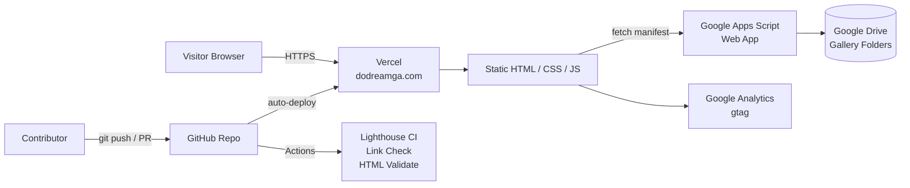

# DoDream Baptist Church — dodreamga.com

[](https://github.com/jwoo6310/dodreamga.com/actions/workflows/quality.yml)
[](https://dodreamga.com)
[](./LICENSE)
[](https://tailwindcss.com/)

The official website of **DoDream Baptist Church**, a bilingual (한국어 / English) Korean-American church community in Georgia. Built and maintained as a static, zero-backend site deployed through Vercel.

**Live site:** [https://dodreamga.com](https://dodreamga.com)

## Overview

This site is multi-page static HTML styled with Tailwind CSS. It supports runtime Korean/English language switching, a photo gallery backed by Google Drive through a Google Apps Script web app, and an interactive world map highlighting supported missionaries. All hosting and content updates happen through GitHub — no server, no database, no build step required for day-to-day updates.

## Architecture



The gallery is intentionally decoupled from the repo: adding photos is a drag-and-drop into a Drive folder, and the Apps Script endpoint reflects them as JSON on next page load. This keeps large media out of Git entirely.

## Tech stack

- **Markup & styling:** HTML5, [Tailwind CSS](https://tailwindcss.com/) v3 compiled via the Tailwind CLI (no runtime CDN)
- **Icons:** [Feather Icons](https://feathericons.com/), [Font Awesome](https://fontawesome.com/)
- **Visual effects:** [Vanta.js](https://www.vantajs.com/) (hero background)
- **Interactive map:** custom SVG world map with per-country click states
- **Photo gallery backend:** Google Apps Script + Google Drive
- **Analytics:** Google Analytics 4 (gtag.js)
- **Hosting:** [Vercel](https://vercel.com/) with custom domain — runs `npm run build` on every deploy
- **CI/CD:** Vercel (auto-deploy on push) + GitHub Actions (CSS build, Lighthouse CI, link check, HTML validation)

## Repository structure

```
.
├── index.html                # Landing page
├── about/                    # Greeting, vision, schedule, directions
├── community/                # POS groups, Korean school, departments
├── event/                    # Regular, academy, and special events
├── nextgen/                  # Youth ministries & photo gallery
├── smd344/                   # Discipleship & supported missionaries
├── archive/                  # Deprecated pages kept for reference
├── assets/
│   ├── css/style.css         # Small custom overrides (loaded after Tailwind)
│   ├── css/tailwind.css      # Built by `npm run build` — gitignored
│   ├── js/script.js          # Nav, i18n, mobile menu, Vanta init
│   ├── js/gallery.js         # Drive-backed album viewer
│   ├── js/missionaries.js    # Interactive world map logic
│   ├── img/                  # Logos, static imagery
│   ├── vid/                  # Background video loops
│   └── favicon/              # Multi-size favicons & webmanifest
├── src/
│   └── tailwind.css          # Tailwind input file (@tailwind directives)
├── tailwind.config.js        # Brand palette, content globs
├── package.json              # Tailwind CLI + build scripts
├── vercel.json               # Vercel build command
└── .github/                  # Workflows, issue & PR templates
```

## Internationalization (i18n)

Language switching is client-side and persistent:

1. Each translatable element has an `id`.
2. Per-page files declare a `window.elementsToTranslate` table: `{ id: { ko, en } }`.
3. `assets/js/script.js` reads language preference from the URL (`?lang=en`) or `localStorage`, applies translations on `DOMContentLoaded`, rewrites all in-site links to preserve the chosen language, and dispatches a `langchange` event for other modules (such as the missionary map).

Default language is Korean.

## Local development

The site needs Tailwind compiled once before it will render correctly.

```bash
# 1. Install dev dependencies (Tailwind CLI)
npm install

# 2. Build the CSS once, or run in watch mode while editing
npm run build       # one-shot, minified production build
# or
npm run dev         # watch mode — rebuilds on every change

# 3. Serve the static files (any static server works)
npm run serve                # http://localhost:8080
# or
python3 -m http.server 8000  # http://localhost:8000
```

The built `assets/css/tailwind.css` is gitignored — it's a build artifact. Vercel rebuilds it on every deploy via the `buildCommand` in `vercel.json`.

## Deployment

The site is hosted on [Vercel](https://vercel.com/), which auto-deploys every push to `main`. On each deploy, Vercel runs `npm install && npm run build` to compile Tailwind, then serves the repository root as static files. The custom domain `dodreamga.com` is configured through Vercel's dashboard. GitHub Actions runs quality checks (CSS build, HTML validation, broken link detection, Lighthouse CI) on every push and PR, but deployment itself is handled entirely by Vercel.

## Contributing

Issues and pull requests are welcome — see [CONTRIBUTING.md](./CONTRIBUTING.md). For bug reports and feature ideas, please use the issue templates in the "New issue" form.

## Roadmap

Tracked on the GitHub Project board. Highlights under consideration:

- Prayer request submission + optional public prayer wall (serverless, Apps Script + Sheets)
- Sermon archive with embedded audio/video
- Event RSVP flow
- Weekly bulletin auto-publisher
- Componentize the duplicated nav/footer markup (currently copy-pasted across every page)

Recently shipped:

- Migrated Tailwind from runtime CDN to a Tailwind CLI build step (purged production CSS, brand palette in `tailwind.config.js`)
- Removed the duplicate Tailwind v2 + Play CDN loads on every page

## License

Code in this repository is released under the [MIT License](./LICENSE). Church-specific content (photos, logos, text, sermons) is © DoDream Baptist Church and is not covered by the MIT license — please request permission before reusing.
